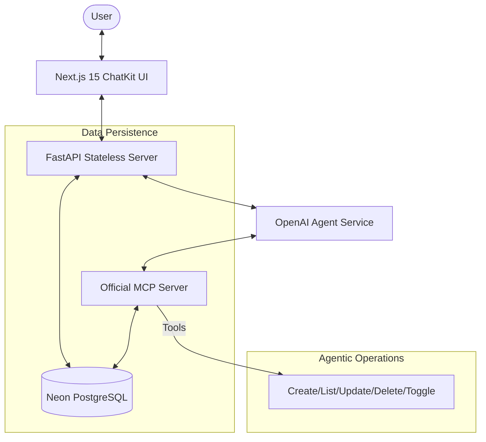

# 🤖 Mission Control: Todo AI Chatbot (Phase-3)

[](https://nextjs.org/)
[](https://fastapi.tiangolo.com/)
[](https://modelcontextprotocol.io/)
[](https://neon.tech/)

A high-performance, agentic task management system built for the **Panaversity Hackathon II (Phase-3)**. This project transforms a standard Todo app into an intelligent, mission-driven assistant powered by the Model Context Protocol (MCP) and OpenAI's frontier models.

---

## 🏗️ Architecture Diagram



---

## 🚀 Key Features (Phase-3 Highlights)

- **Agentic Chat Interface**: A full-width, futuristic chat terminal (ChatKit style) supporting real-time streaming and natural language task management in **English and Urdu**.
- **Official MCP Server**: Implements the Model Context Protocol with 5 specialized tools:
  - `create_task`: Intelligent task distillation from conversation.
  - `list_tasks`: Context-aware task retrieval.
  - `update_task`: Modify task details through natural language.
  - `delete_task`: Remove tasks via assistant.
  - `toggle_task_completion`: Instant status updates.
- **Stateless Backend**: Every interaction is context-aware. The backend fetches conversation history from **Neon DB** and persists state before every response.
- **Mission Schedule (Calendar)**:
  - Interactive grid view for scheduled tasks.
  - **Unscheduled Tasks (Backlog)**: A dedicated sidebar for tasks missing `due_date`.
  - **Inline Date Picker**: Quick-action scheduling directly from the backlog cards.
- **User Isolation**: Strict multi-tenant security ensuring users only see and manage their own tasks/conversations.

---

## 🛠️ Technical Stack

- **Frontend**: Next.js 15 (App Router), Tailwind CSS, Lucide Icons, Better Auth.
- **Backend**: FastAPI (Python), SQLModel, Pydantic, SQLAlchemy.
- **AI Engine**: OpenAI SDK (GPT-4o), OpenAI Function Calling.
- **MCP Protocol**: Official MCP Python SDK (FastMCP).
- **Database**: Neon Serverless PostgreSQL (Hosted on Hugging Face/Vercel).
- **Security**: JWT-based Authentication, Mandatory `user_id` context propagation.

---

## 📁 Project Structure

```text
.
├── backend/                   # FastAPI Stateless Server
│   ├── src/
│   │   ├── api/               # Endpoint controllers (Chat, Tasks, Auth)
│   │   ├── models/            # SQLModel Definitions (Task, Conversation, Message)
│   │   ├── services/          # Agent Logic & Database persistence
│   │   └── database.py        # Neon DB connection (Async)
│   ├── main.py                # Server Entrypoint
│   └── pyproject.toml         # Python Dependencies
├── frontend/                  # Next.js 15+ Web Application
│   ├── src/
│   │   ├── app/
│   │   │   ├── dashboard/     # Protected Routes (Schedule, Tasks, Chat)
│   │   │   └── (auth)/        # Auth Routes (Better Auth)
│   │   ├── components/
│   │   │   ├── chat/          # ChatKit-style Interface
│   │   │   └── dashboard/     # Calendar & Sidebar components
│   │   └── services/          # API Clients
│   └── package.json           # Frontend Dependencies
├── mcp-server/                # Official MCP Server implementation
│   ├── src/
│   │   ├── tools/             # 5 Core Agentic Tools
│   │   └── server.py          # FastMCP Implementation
│   └── pyproject.toml         # MCP Dependencies
└── specs/                     # Spec-Driven Development Artifacts
```

---

## ⚙️ Installation & Setup

### 1. Backend Setup
```bash
cd backend
python -m venv venv
source venv/bin/activate  # On Windows: venv\Scripts\activate
pip install -r requirements.txt
uvicorn main:app --reload
```

### 2. Frontend Setup
```bash
cd frontend
npm install
npm run dev
```

### 3. MCP Server Setup (Optional for standalone)
```bash
cd mcp-server
pip install -e .
python src/server.py
```

---

## 🔑 Environment Variables

Create a `.env` file in the `backend/` and `frontend/` directories:

### Backend (.env)
```env
OPENAI_API_KEY=your_openai_key
DATABASE_URL=your_neon_postgres_url
BETTER_AUTH_SECRET=your_auth_secret
```

### Frontend (.env.local)
```env
NEXT_PUBLIC_API_URL=http://localhost:8000
BETTER_AUTH_SECRET=your_auth_secret
NEXT_PUBLIC_APP_URL=http://localhost:3000
```

---

## 📖 How to Use

1. **Dashboard**: Navigate to the "Chat" tab to meet your AI assistant.
2. **Commands**:
   - *"Add a task to buy groceries tomorrow at 4 PM."*
   - *"Show my pending tasks for this week."*
   - *"Mujhe kal subhah 9 baje meeting remind karwao."* (Urdu Support)
3. **Schedule**: Visit the "Schedule" page to see your tasks on a calendar.
4. **Backlog**: If a task has no date, it appears in the "Unscheduled" list. Click **📅 Set Date** to quickly move it to the calendar.

---

## ⚖️ License
This project is part of the Panaversity Hackathon II and is governed by hackathon competition rules.

🤖 *Generated with [Claude Code](https://claude.com/claude-code)*
